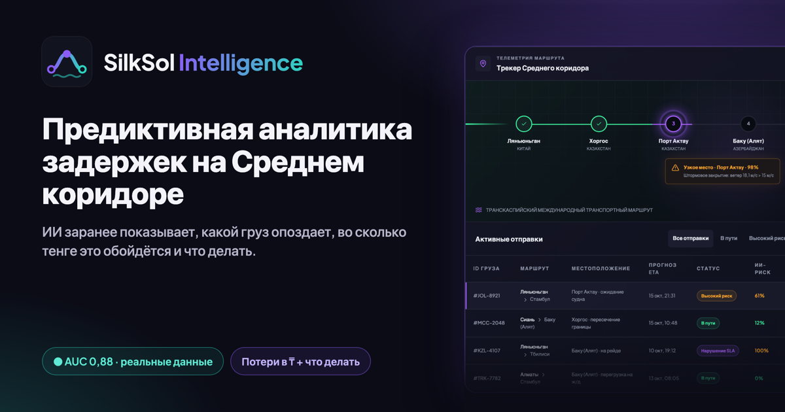
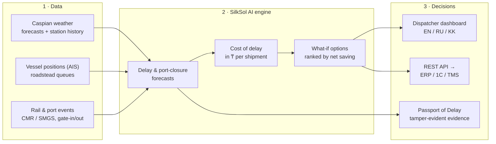
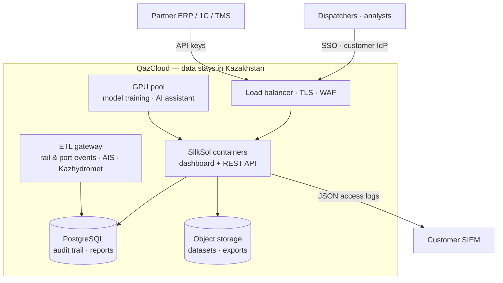
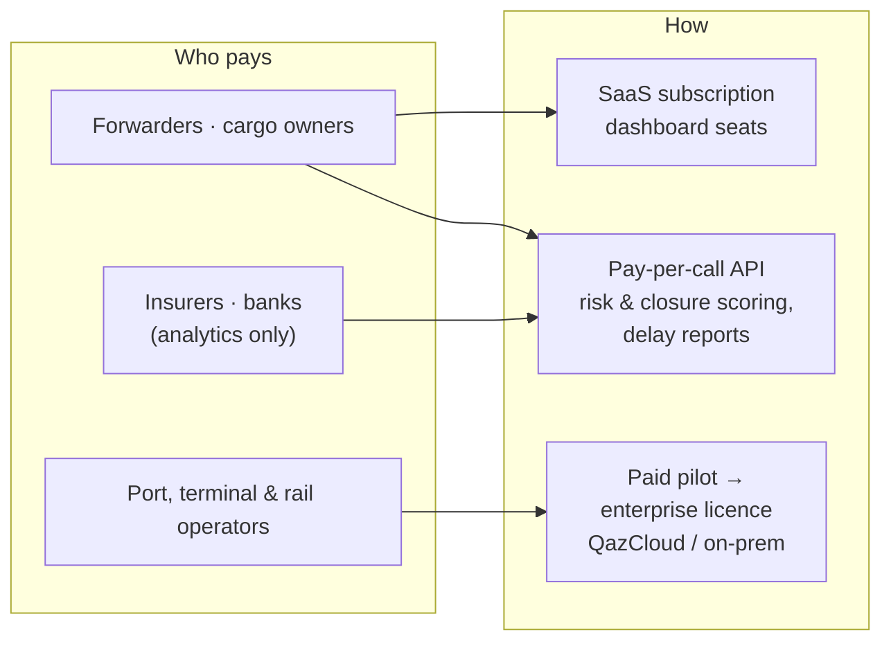

<h1 align="center">SilkSol Intelligence</h1>

  <em>AI decision support for Middle Corridor (TITR / ТМТМ) logistics: know which shipment will be late, what it will cost in tenge, and what to do about it — before it happens.</em>

  <a href="https://silksol-intelligence.datariglab.kz"><b>Live demo</b></a> ·
  <b>English</b> · <a href="#-русский">Русский</a> · <a href="#-қазақша">Қазақша</a>

  
  
  

  
  
  
  
  
  
  
  

  

---

## 💡 Executive Summary

Storms close the Caspian ports of Aktau, Kuryk and Baku/Alat; queues on the roadstead and at rail borders are unpredictable. Today the corridor reacts after the fact: wagons and vessels stand idle, demurrage and SLA penalties pile up, and forwarders, ports and cargo owners argue about who caused the delay.

SilkSol Intelligence turns that into numbers a manager can act on:

|     | Killer feature                                  | What the user gets                                                                                                                                    |
| --- | ----------------------------------------------- | ----------------------------------------------------------------------------------------------------------------------------------------------------- |
| 🔮  | **Predictive delay risk**                       | Probability that each shipment misses its contractual ETA, a P10–P90 ETA range and the drivers behind the risk                                        |
| 🌊  | **Port-closure forecast, trained on real data** | Storm-closure probability for Aktau, Kuryk and Baku 1–3 days ahead — validated out of time (see below)                                                |
| ₸   | **Cost of delay in tenge**                      | Expected loss per shipment: storage & demurrage, wagon idle, SLA penalties, late delivery                                                             |
| 🧭  | **What to do — with savings**                   | Operational options (switch Aktau ↔ Kuryk, priority ferry slot, hold wagons during a storm) ranked by net saving in ₸, with risk and ETA before/after |
| 🧾  | **Passport of Delay**                           | A tamper-evident evidence report (weather, vessel positions, dwell events) that settles disputes and supports insurers' and banks' decisions          |

It sells **analytics and decision support** — no payments, custody, tokens or insurance products. The final decision always stays with a person.

---

## ⚙️ How it works

Every number on screen carries its source and a `SIMULATED` / `LIVE` label, and every risk score comes with the factors that drive it — as the Law of the Republic of Kazakhstan "On Artificial Intelligence" expects.

---

## 📈 Validated on real data

The port-closure forecast was trained on real weather-station observations at Aktau and Baku and tested out of time on forecasts issued 1–3 days ahead (March 2024 – December 2025: 1,304 port-days, 53 storm-closure days).

| Forecast lead | AUC  | Storm-closure days warned in advance | Simple threshold rule "wind > 15 m/s" |
| ------------- | ---- | ------------------------------------ | ------------------------------------- |
| 1 day         | 0.88 | **36%**                              | 2%                                    |
| 2 days        | 0.89 | **32%**                              | 2%                                    |
| 3 days        | 0.89 | **23%**                              | 0%                                    |

"Closure" is defined by sustained wind ≥ 15 m/s, the ferry stop threshold; harbour-master closure logs from the pilot partner replace this proxy. Dwell-time and ETA components are calibrated on the pilot partner's data — that is the goal of the pilot.

---

## 🧠 ML & Data Science

| Question the model answers                             | Output                                           | Status                                                |
| ------------------------------------------------------ | ------------------------------------------------ | ----------------------------------------------------- |
| Will this shipment miss its contractual ETA?           | Probability + P10–P90 ETA, risk drivers          | Working; calibrated on the pilot partner's dwell data |
| Will the port close for storms in the next 1–3 days?   | Daily closure probability + warning              | **Trained and validated on real data**                |
| What does the delay cost, and which action saves most? | Expected loss in ₸, options ranked by net saving | Working (demo tariffs)                                |

- **Data.** Hourly weather-station observations at Aktau and Baku (2010–2025), archived numerical weather forecasts, vessel positions (AIS), rail and port events (CMR / SMGS, gate-in / gate-out).
- **Validation without leakage.** Strict out-of-time split; the model is scored only on forecasts that were actually available 1, 2 and 3 days before the event; every lead time is reported separately against a simple-rule baseline and against climatology (Brier skill).
- **Uncertainty, not point guesses.** Delay and ETA come as distributions (P10–P90) from scenario simulation; what-if options are compared on paired scenarios, so the difference reflects the action, not noise.
- **Explainable and governed.** Factor contributions behind every score, a model card with what is calibrated and what is not, data provenance on every number, versioned calibration artefacts and a reproducible training pipeline — in line with the Law of RK "On Artificial Intelligence".
- **MLOps in QazCloud (pilot).** Retraining on the partner's history on QazCloud GPUs, drift and calibration monitoring, champion / challenger releases, and a local LLM for the Russian / Kazakh dispatcher assistant — data never leaves Kazakhstan.

---

## 🧪 Quality & testing

| Layer                       | What is checked                                                                                                                                        | Result                                                        |
| --------------------------- | ------------------------------------------------------------------------------------------------------------------------------------------------------ | ------------------------------------------------------------- |
| Unit & integration (Vitest) | Forecasting engine, port-closure model, cost of delay and recommendations, SLA, audit trail, delay reports, REST API, translations                     | **52 tests**, all passing                                     |
| Coverage of the core        | Calculation core and REST API (forecasting, port-closure model, economics, SLA, audit trail, reports); UI screens are covered by the E2E suite instead | **95% lines** · 93% statements · 94% functions · 80% branches |
| End-to-end (Playwright)     | Real browser against the production build: dashboard, risk chart, SLA monitor, delay report issue & verification, audit trail, EN → RU → KK            | **11 scenarios**, all passing                                 |
| CI (GitHub Actions)         | Typecheck, lint, unit tests with coverage, production build; E2E suite                                                                                 | Workflows in `.github/workflows`, triggered on push to `main` |

---

## 🗺 Status & roadmap

|     | Capability                                                                    | Status                     |
| --- | ----------------------------------------------------------------------------- | -------------------------- |
| ✅  | Corridor dashboard (EN / RU / KK), delay risk, P10–P90 ETA, SLA monitor       | Working MVP                |
| ✅  | Port-closure forecast trained and validated on real data                      | Done                       |
| ✅  | Cost of delay in ₸ and what-if recommendations                                | Working MVP (demo tariffs) |
| ✅  | Passport of Delay with tamper-evident audit trail                             | Working MVP                |
| ✅  | REST API with access keys and logging, Docker image                           | Done                       |
| 🔜  | Pilot on Aktau – Baku: partner's dwell data, contract tariffs, closure logs   | Pilot                      |
| 🔜  | AI dispatcher assistant in Russian and Kazakh on a local LLM in QazCloud      | Next stage                 |
| 🔜  | SSO, PostgreSQL, ERP / 1C integration                                         | Pilot                      |
| 🔭  | Whole TITR: Khorgos, Dostyk, Poti, Batumi; scoring API for insurers and banks | Scale                      |

The demo runs a simulated corridor scenario (clearly labelled); tariffs in the cost calculator are demo assumptions — a pilot uses the partner's contract rates.

---

## ☁️ Deployment in QazCloud

- One container (dashboard + API), non-root, read-only file system, health check.
- All data, backups and personal data stay in Kazakhstan; deployment in the customer's perimeter.
- Compliance with the Law of RK "On AI", personal-data localisation and corporate IS requirements: [docs/COMPLIANCE.md](./docs/COMPLIANCE.md). Deployment: [docs/DEPLOYMENT.md](./docs/DEPLOYMENT.md). API: [docs/API.md](./docs/API.md).

---

## 💼 Business model

The price is justified by the money the platform saves: avoided demurrage, wagon idle and SLA penalties — shown per shipment in tenge.

---

## 🛠 Tech

React 19 · TypeScript · TanStack Start · Tailwind CSS · Recharts · Node.js 22 · Docker · Vitest · Playwright. Interface in English, Russian and Kazakh.

---

## 🔒 Intellectual property & license

**SilkSol Intelligence is proprietary software. This repository is published for evaluation only and is not open source.**

- © 2026 **SilkSol / s0nakh**. All rights reserved. The source code, models, model parameters, calibration and evaluation methods, data processing pipelines, tariff and recommendation logic, user interface, texts, the "SilkSol" name and logo are protected by the Law of the Republic of Kazakhstan "On Copyright and Related Rights", the Civil Code of the Republic of Kazakhstan and international copyright treaties.
- **No license is granted.** You may not copy, modify, deploy, host, sell, sublicense, create derivative works from, or use this code, its models or its documentation to train or benchmark other systems — commercially or otherwise — without prior written permission.
- Viewing the repository on GitHub (as GitHub's Terms of Service allow) does not grant any right of use.
- Authorship and the date of creation are evidenced by the commit history. Infringements are pursued under the laws of the Republic of Kazakhstan.
- Partnership, pilot and licensing requests: **sophia.akhmetova@datariglab.kz**.

Full terms: [LICENSE](./LICENSE).

---

## 🇷🇺 Русский

<b>Открыть русскую версию</b>

 

**SilkSol Intelligence** — ИИ-система поддержки решений для логистики Среднего коридора (ТМТМ): заранее показывает, какой груз опоздает, во сколько тенге это обойдётся и что с этим делать. [Живое демо](https://silksol-intelligence.datariglab.kz).

### Ключевые возможности

|     | Возможность                                    | Что получает пользователь                                                                                                     |
| --- | ---------------------------------------------- | ----------------------------------------------------------------------------------------------------------------------------- |
| 🔮  | **Предиктивный риск задержки**                 | Вероятность срыва договорного ETA по каждому грузу, диапазон ETA P10–P90 и факторы риска                                      |
| 🌊  | **Прогноз закрытия портов на реальных данных** | Вероятность штормового закрытия Актау, Курыка и Баку за 1–3 дня, проверено на отложенном периоде                              |
| ₸   | **Стоимость задержки в тенге**                 | Ожидаемые потери по грузу: хранение и демередж, простой вагонов, штрафы SLA, опоздание                                        |
| 🧭  | **Что делать — с экономией**                   | Варианты (Актау ↔ Курык, приоритетный паром, придержать вагоны на время шторма) с чистой экономией в ₸, риском и ETA до/после |
| 🧾  | **Паспорт задержки**                           | Защищённый от подделки отчёт с доказательствами для разрешения споров, страховщиков и банков                                  |

Мы продаём аналитику и поддержку решений — без платежей, токенов и страховых продуктов. Решение всегда за человеком.

### Проверка на реальных данных

Прогноз закрытия портов обучен на наблюдениях метеостанций Актау и Баку и проверен на прогнозах за 1–3 дня (март 2024 – декабрь 2025, 1 304 порто-дня, 53 штормовых дня): **AUC 0,88–0,89**, за сутки модель заранее предупреждает о **36%** штормовых закрытий, простое пороговое правило «ветер > 15 м/с» — о 2%. Модели простоя и ETA калибруются на данных пилотного партнёра.

### ML и качество

- **Без утечки будущего:** модель оценивается только на прогнозах, которые реально были доступны за 1, 2 и 3 дня до события, отдельно по каждому горизонту, против простого правила и климатологии.
- **Неопределённость:** задержка и ETA — распределения (P10–P90); варианты «что делать» сравниваются на парных сценариях.
- **Объяснимость и контроль:** факторы за каждой оценкой, карточка модели, источник у каждого числа, воспроизводимый пайплайн обучения — в духе Закона РК «Об ИИ».
- **Тесты:** 52 unit-теста, покрытие ядра расчётов и API 95% строк (экраны проверяются e2e-тестами), 11 e2e-сценариев в браузере на продакшен-сборке, CI-воркфлоу GitHub Actions.

### Статус

Работают: дашборд (RU/KZ/EN), риск и ETA, монитор SLA, прогноз закрытия портов, стоимость задержки и рекомендации (на демо-тарифах), паспорт задержки, REST API, Docker. Следующие этапы: пилот Актау – Баку на данных партнёра, ИИ-ассистент диспетчера на русском и казахском на локальной LLM в QazCloud, SSO и интеграция с ERP/1С.

Развёртывание в QazCloud, хранение данных в РК, соответствие Закону РК «Об ИИ»: [docs/DEPLOYMENT.md](./docs/DEPLOYMENT.md), [docs/COMPLIANCE.md](./docs/COMPLIANCE.md).

### Интеллектуальная собственность

**SilkSol Intelligence — проприетарное программное обеспечение. Репозиторий опубликован только для ознакомления и не является open source.** © 2026 SilkSol / s0nakh. Все права защищены. Код, модели и их параметры, методы калибровки и оценки, логика тарифов и рекомендаций, интерфейс, название и логотип охраняются Законом РК «Об авторском праве и смежных правах» и Гражданским кодексом РК. Лицензия не предоставляется: копирование, изменение, развёртывание, продажа, создание производных продуктов и использование для обучения других систем без письменного разрешения запрещены. Нарушения преследуются по законодательству РК. Сотрудничество и пилоты: sophia.akhmetova@datariglab.kz. Полный текст: [LICENSE](./LICENSE).

---

## 🇰🇿 Қазақша

<b>Қазақша нұсқасын ашу</b>

 

**SilkSol Intelligence** — Орта дәліз (ТХКБ) логистикасына арналған шешім қабылдауды қолдайтын ЖИ жүйесі: қай жүктің кешігетінін, оның теңгемен қанша тұратынын және не істеу керектігін алдын ала көрсетеді. [Демо](https://silksol-intelligence.datariglab.kz).

### Негізгі мүмкіндіктер

|     | Мүмкіндік                                             | Пайдаланушы не алады                                                                                |
| --- | ----------------------------------------------------- | --------------------------------------------------------------------------------------------------- |
| 🔮  | **Кешігу тәуекелінің болжамы**                        | Әр жүктің шарттық ETA-ны бұзу ықтималдығы, ETA P10–P90 және тәуекел факторлары                      |
| 🌊  | **Нақты деректерде оқытылған порттың жабылу болжамы** | Ақтау, Құрық және Баку порттарының дауылмен жабылу ықтималдығы 1–3 күн бұрын                        |
| ₸   | **Кідірістің теңгемен құны**                          | Жүк бойынша күтілетін шығын: сақтау және демередж, вагондардың тұрып қалуы, SLA айыппұлдары, кешігу |
| 🧭  | **Не істеу керек — үнеммен**                          | Нұсқалар (Ақтау ↔ Құрық, басым паром, дауыл кезінде вагондарды ұстау) теңгедегі таза үнеммен        |
| 🧾  | **Кідіріс паспорты**                                  | Дауларды шешуге, сақтандырушылар мен банктерге арналған қолдан жасаудан қорғалған есеп              |

### Нақты деректермен тексеру

Порттың жабылу болжамы Ақтау мен Баку метеостанцияларының бақылауларында оқытылып, 1–3 күн бұрынғы болжамдарда тексерілді (2024 ж. наурыз – 2025 ж. желтоқсан): **AUC 0,88–0,89**. Тұрып қалу және ETA модельдері пилоттық серіктестің деректерінде калибрленеді.

### ML және сапа

Модель тек оқиғадан 1, 2 және 3 күн бұрын шын мәнінде қолжетімді болған болжамдарда бағаланады. Нәтижелер — үлестірімдер (P10–P90), әр бағаның факторлары көрсетіледі. 52 unit-тест, ядроның 95% жолдары тестпен қамтылған, 11 e2e-сценарий, GitHub Actions CI-воркфлоулары.

### Зияткерлік меншік

**SilkSol Intelligence — меншікті бағдарламалық қамтамасыз ету. Репозиторий тек танысу үшін жарияланған, open source емес.** © 2026 SilkSol / s0nakh. Барлық құқықтар қорғалған. Жазбаша рұқсатсыз көшіруге, өзгертуге, орналастыруға, сатуға, туынды өнімдер жасауға және басқа жүйелерді оқытуға пайдалануға тыйым салынады. Бұзушылықтар Қазақстан Республикасының заңнамасы бойынша қудаланады. Толық мәтін: [LICENSE](./LICENSE).

