

<h1 align="center">SilkSol Intelligence</h1>

  <em>AI decision support for Middle Corridor (TITR / ТМТМ) logistics: know which shipment will be late, what it will cost in tenge, and what to do about it — before it happens.</em>

  <a href="https://silksol-intelligence.datariglab.kz"><b>Live demo</b></a> ·
  <b>English</b> · <a href="#-русский">Русский</a> · <a href="#-қазақша">Қазақша</a>

  <a href="https://www.loom.com/share/b71579e4a4ca41319a6399515338aac8">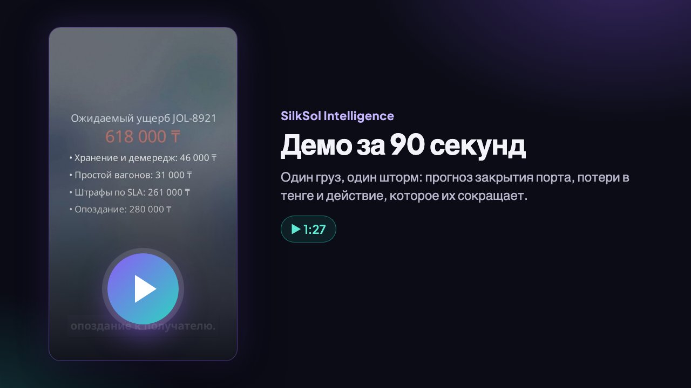</a>
  &nbsp;
  <a href="https://www.loom.com/share/a0cfb3ba7f3948a194fdc93fd32de418">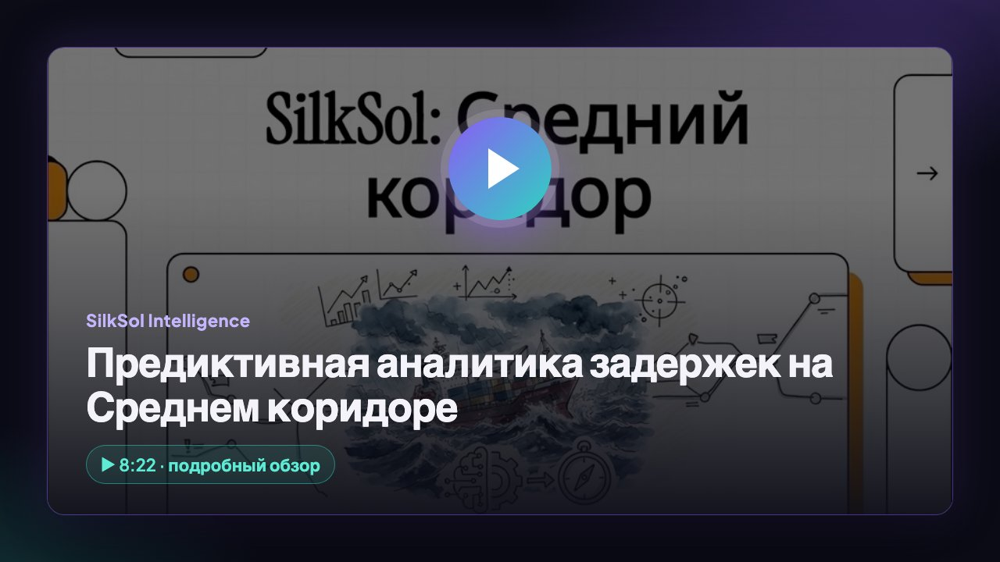</a>
   
  ▶ <a href="https://www.loom.com/share/b71579e4a4ca41319a6399515338aac8"><b>Demo in 90 seconds</b></a> — how it works on one shipment &nbsp;·&nbsp; ▶ <a href="https://www.loom.com/share/a0cfb3ba7f3948a194fdc93fd32de418"><b>8-minute overview</b></a> — the problem, the model and the pilot (videos in Russian)

  
  
  

  
  
  
  
  
  
  
  

  

---

## 💡 Executive Summary

Storms close the Caspian ports of Aktau, Kuryk and Baku/Alat; queues on the roadstead and at rail borders are unpredictable. Today the corridor reacts after the fact: wagons and vessels stand idle, demurrage and SLA penalties pile up, and forwarders, ports and cargo owners argue about who caused the delay.

SilkSol Intelligence turns that into numbers a manager can act on:

|     | Killer feature                                  | What the user gets                                                                                                                                    |
| --- | ----------------------------------------------- | ----------------------------------------------------------------------------------------------------------------------------------------------------- |
| 🔮  | **Predictive delay risk**                       | Probability that each shipment misses its contractual ETA, a P10–P90 ETA range and the drivers behind the risk                                        |
| 🌊  | **Port-closure forecast, trained on real data** | Storm-closure probability for Aktau, Kuryk and Baku 1–3 days ahead — validated out of time (see below)                                                |
| ₸   | **Cost of delay in tenge**                      | Expected loss per shipment: storage & demurrage, wagon idle, SLA penalties, late delivery                                                             |
| 🧭  | **What to do — with savings**                   | Operational options (switch Aktau ↔ Kuryk, priority ferry slot, hold wagons during a storm) ranked by net saving in ₸, with risk and ETA before/after |
| 🧾  | **Passport of Delay**                           | A tamper-evident evidence report (weather, vessel positions, dwell events) that settles disputes and supports insurers' and banks' decisions          |

It sells **analytics and decision support** — no payments, custody, tokens or insurance products. The final decision always stays with a person.

---

## ⚙️ How it works

<picture>
  <source media="(prefers-color-scheme: light)" srcset="docs/diagrams/how-it-works.en.light.png">
  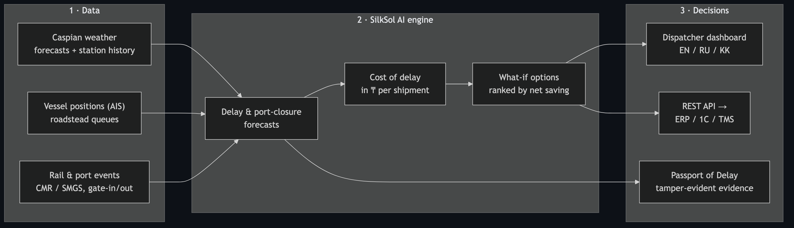
</picture>

🔍 Interactive diagram (zoom &amp; pan)

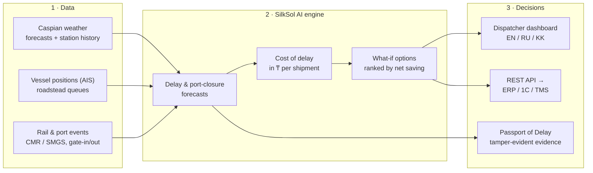

Every number on screen carries its source and a `SIMULATED` / `LIVE` label, and every risk score comes with the factors that drive it — as the Law of the Republic of Kazakhstan "On Artificial Intelligence" expects.

---

## 📈 Validated on real data

The port-closure forecast was trained on real weather-station observations at Aktau and Baku and tested out of time on forecasts issued 1–3 days ahead (March 2024 – December 2025: 1,304 port-days, 53 storm-closure days).

| Forecast lead | AUC  | Storm-closure days warned in advance | Simple threshold rule "wind > 15 m/s" |
| ------------- | ---- | ------------------------------------ | ------------------------------------- |
| 1 day         | 0.88 | **36%**                              | 2%                                    |
| 2 days        | 0.89 | **32%**                              | 2%                                    |
| 3 days        | 0.89 | **23%**                              | 0%                                    |

"Closure" is defined by sustained wind ≥ 15 m/s, the ferry stop threshold; harbour-master closure logs from the pilot partner replace this proxy. Dwell-time and ETA components are calibrated on the pilot partner's data — that is the goal of the pilot.

---

## 🧠 ML & Data Science

| Question the model answers                             | Output                                           | Status                                                |
| ------------------------------------------------------ | ------------------------------------------------ | ----------------------------------------------------- |
| Will this shipment miss its contractual ETA?           | Probability + P10–P90 ETA, risk drivers          | Working; calibrated on the pilot partner's dwell data |
| Will the port close for storms in the next 1–3 days?   | Daily closure probability + warning              | **Trained and validated on real data**                |
| What does the delay cost, and which action saves most? | Expected loss in ₸, options ranked by net saving | Working (demo tariffs)                                |

- **Data.** Hourly weather-station observations at Aktau and Baku (2010–2025), archived numerical weather forecasts, vessel positions (AIS), rail and port events (CMR / SMGS, gate-in / gate-out).
- **Validation without leakage.** Strict out-of-time split; the model is scored only on forecasts that were actually available 1, 2 and 3 days before the event; every lead time is reported separately against a simple-rule baseline and against climatology (Brier skill).
- **Uncertainty, not point guesses.** Delay and ETA come as distributions (P10–P90) from scenario simulation; what-if options are compared on paired scenarios, so the difference reflects the action, not noise.
- **Explainable and governed.** Factor contributions behind every score, a model card with what is calibrated and what is not, data provenance on every number, versioned calibration artefacts and a reproducible training pipeline — in line with the Law of RK "On Artificial Intelligence".
- **MLOps in QazCloud (pilot).** Retraining on the partner's history on QazCloud GPUs, drift and calibration monitoring, champion / challenger releases, and a local LLM for the Russian / Kazakh dispatcher assistant — data never leaves Kazakhstan.

---

## 🧪 Quality & testing

| Layer                       | What is checked                                                                                                                                        | Result                                                        |
| --------------------------- | ------------------------------------------------------------------------------------------------------------------------------------------------------ | ------------------------------------------------------------- |
| Unit & integration (Vitest) | Forecasting engine, port-closure model, cost of delay and recommendations, SLA, audit trail, delay reports, REST API, translations                     | **52 tests**, all passing                                     |
| Coverage of the core        | Calculation core and REST API (forecasting, port-closure model, economics, SLA, audit trail, reports); UI screens are covered by the E2E suite instead | **95% lines** · 93% statements · 94% functions · 80% branches |
| End-to-end (Playwright)     | Real browser against the production build: dashboard, risk chart, SLA monitor, delay report issue & verification, audit trail, EN → RU → KK            | **11 scenarios**, all passing                                 |
| CI (GitHub Actions)         | Typecheck, lint, unit tests with coverage, production build; E2E suite                                                                                 | Workflows in `.github/workflows`, triggered on push to `main` |

---

## 🗺 Status & roadmap

|     | Capability                                                                    | Status                     |
| --- | ----------------------------------------------------------------------------- | -------------------------- |
| ✅  | Corridor dashboard (EN / RU / KK), delay risk, P10–P90 ETA, SLA monitor       | Working MVP                |
| ✅  | Port-closure forecast trained and validated on real data                      | Done                       |
| ✅  | Cost of delay in ₸ and what-if recommendations                                | Working MVP (demo tariffs) |
| ✅  | Passport of Delay with tamper-evident audit trail                             | Working MVP                |
| ✅  | REST API with access keys and logging, Docker image                           | Done                       |
| 🔜  | Pilot on Aktau – Baku: partner's dwell data, contract tariffs, closure logs   | Pilot                      |
| 🔜  | AI dispatcher assistant in Russian and Kazakh on a local LLM in QazCloud      | Next stage                 |
| 🔜  | SSO, PostgreSQL, ERP / 1C integration                                         | Pilot                      |
| 🔭  | Whole TITR: Khorgos, Dostyk, Poti, Batumi; scoring API for insurers and banks | Scale                      |

The demo runs a simulated corridor scenario (clearly labelled); tariffs in the cost calculator are demo assumptions — a pilot uses the partner's contract rates.

---

## 🚀 Pilot plan & KPIs

A 3-month pilot on the **Aktau – Baku** route with a rail or port operator, run on QazCloud.

<picture>
  <source media="(prefers-color-scheme: light)" srcset="docs/diagrams/pilot-plan.en.light.png">
  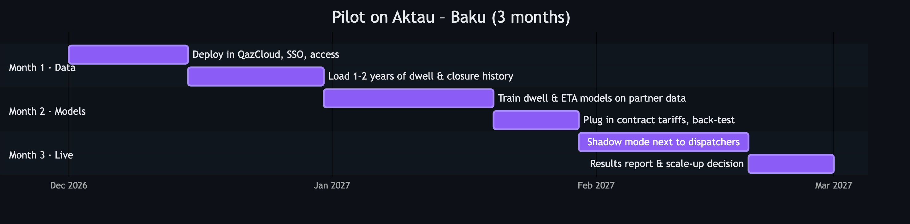
</picture>

🔍 Interactive diagram (zoom &amp; pan)

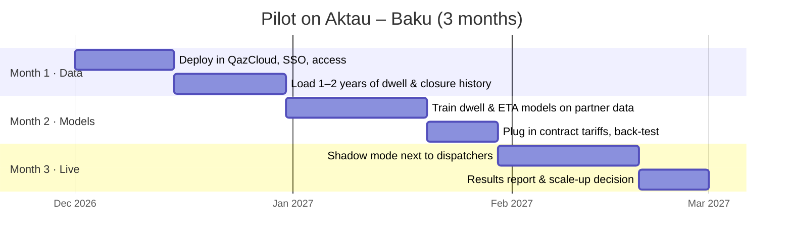

| KPI                              | How it is measured                                                                               | Target                                           |
| -------------------------------- | ------------------------------------------------------------------------------------------------ | ------------------------------------------------ |
| ETA accuracy                     | Error of the predicted arrival vs. actual, compared with the partner's current planning          | Better than the current plan, agreed at kick-off |
| Storm closures warned in advance | Share of closure days flagged ≥ 24 h ahead, on the harbour master's own log                      | ≥ 30% (already 36% on the weather proxy)         |
| Money saved                      | ₸ of demurrage, wagon idle and SLA penalties avoided on the recommendations dispatchers accepted | Reported per shipment and in total               |
| Disputes                         | Delay disputes settled with a Passport of Delay vs. before the pilot                             | Fewer disputes, shorter settlement               |
| Adoption                         | Dispatchers using the dashboard weekly; recommendations accepted                                 | Agreed at kick-off                               |

**What we need from the partner:** a VM or namespace in QazCloud with SSO; 1–2 years of dwell events (arrivals / departures per node, CMR / SMGS) and the harbour master's closure log; contract tariffs; one dispatcher team for shadow mode and feedback.

---

## ☁️ Deployment in QazCloud

<picture>
  <source media="(prefers-color-scheme: light)" srcset="docs/diagrams/deployment.en.light.png">
  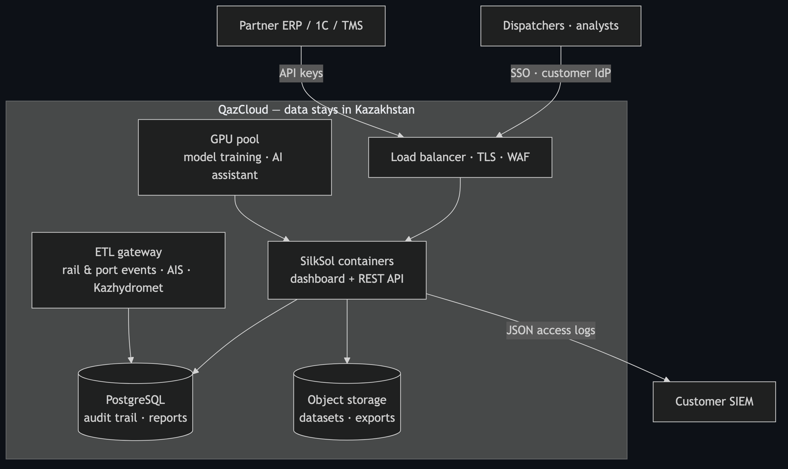
</picture>

🔍 Interactive diagram (zoom &amp; pan)

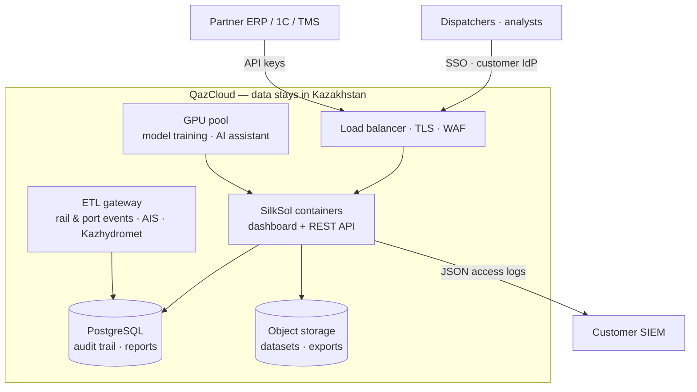

- One container (dashboard + API), non-root, read-only file system, health check.
- All data, backups and personal data stay in Kazakhstan; deployment in the customer's perimeter.
- Compliance with the Law of RK "On AI", personal-data localisation and corporate IS requirements: [docs/COMPLIANCE.md](./docs/COMPLIANCE.md). Deployment: [docs/DEPLOYMENT.md](./docs/DEPLOYMENT.md). API: [docs/API.md](./docs/API.md).

---

## ⚡ Why QazCloud

| QazCloud resource                | What SilkSol uses it for                                                                                                                                                                                                                              |
| -------------------------------- | ----------------------------------------------------------------------------------------------------------------------------------------------------------------------------------------------------------------------------------------------------- |
| **GPU**                          | Local LLM for the Russian / Kazakh dispatcher assistant (inference and fine-tuning on logistics language) — no data goes to foreign AI APIs; large scenario simulations and hyper-parameter search when models are retrained on the partner's history |
| **CPU / Kubernetes**             | Dashboard and REST API, forecasting and what-if engine, scheduled retraining of dwell and ETA models                                                                                                                                                  |
| **Storage in Kazakhstan**        | Partner's dwell history, audit trail, delay reports, training datasets — personal data stays in the country                                                                                                                                           |
| **AI & data-science expertise**  | Review of the validation protocol, model monitoring, MLOps practices                                                                                                                                                                                  |
| **Pilot in a portfolio company** | Real dwell data and harbour-master logs — the one thing that turns the expert-set dwell model into a trained one                                                                                                                                      |

---

## 🛡 Security

| Control        | How                                                                                                                              | Status |
| -------------- | -------------------------------------------------------------------------------------------------------------------------------- | ------ |
| API access     | Per-client API keys, stored as SHA-256 digests, constant-time comparison; health and spec endpoints only are public              | ✅     |
| Audit          | JSON access log for every API call (client name, never the key) → customer SIEM; tamper-evident SHA-256 audit trail per shipment | ✅     |
| Container      | Non-root user, read-only file system, no-new-privileges, health check                                                            | ✅     |
| Secrets        | Only in environment / secret store — never in the image or the repository                                                        | ✅     |
| Data residency | All data, backups and personal data in QazCloud data centres in Kazakhstan                                                       | Pilot  |
| Identity       | SSO via the customer's IdP (OIDC) or Keycloak; role-based access                                                                 | Pilot  |
| Network        | TLS, WAF and rate limiting on the QazCloud load balancer                                                                         | Pilot  |
| Supply chain   | Locked dependencies; image vulnerability scanning in the pilot CI                                                                | Pilot  |

---

## 💼 Business model

<picture>
  <source media="(prefers-color-scheme: light)" srcset="docs/diagrams/business-model.en.light.png">
  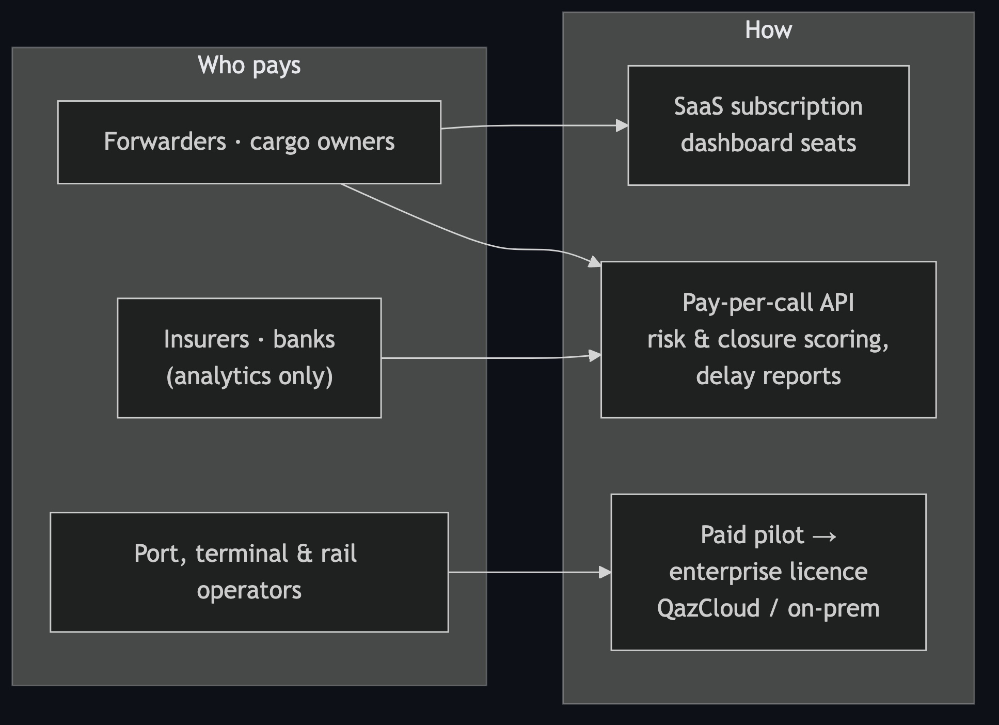
</picture>

🔍 Interactive diagram (zoom &amp; pan)

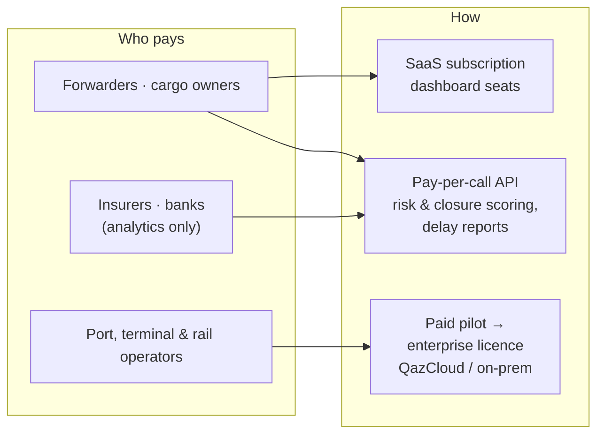

The price is justified by the money the platform saves: avoided demurrage, wagon idle and SLA penalties — shown per shipment in tenge.

---

## 🛠 Tech

React 19 · TypeScript · TanStack Start · Tailwind CSS · Recharts · Node.js 22 · Docker · Vitest · Playwright. Interface in English, Russian and Kazakh.

---

## 🔒 Intellectual property & license

**SilkSol Intelligence is proprietary software. This repository is published for evaluation only and is not open source.**

- © 2026 **SilkSol / s0nakh**. All rights reserved. The source code, models, model parameters, calibration and evaluation methods, data processing pipelines, tariff and recommendation logic, user interface, texts, the "SilkSol" name and logo are protected by the Law of the Republic of Kazakhstan "On Copyright and Related Rights", the Civil Code of the Republic of Kazakhstan and international copyright treaties.
- **No license is granted.** You may not copy, modify, deploy, host, sell, sublicense, create derivative works from, or use this code, its models or its documentation to train or benchmark other systems — commercially or otherwise — without prior written permission.
- Viewing the repository on GitHub (as GitHub's Terms of Service allow) does not grant any right of use.
- Authorship and the date of creation are evidenced by the commit history. Infringements are pursued under the laws of the Republic of Kazakhstan.
- Partnership, pilot and licensing requests: **sophia.akhmetova@datariglab.kz**.

Full terms: [LICENSE](./LICENSE).

---

## 🇷🇺 Русский

<b>Открыть русскую версию</b>

 

<em>ИИ-система поддержки решений для логистики Среднего коридора (ТМТМ): заранее показывает, какой груз опоздает, во сколько тенге это обойдётся и что с этим делать.</em>

  <a href="https://silksol-intelligence.datariglab.kz"><b>Живое демо</b></a> ·
  ▶ <a href="https://www.loom.com/share/b71579e4a4ca41319a6399515338aac8"><b>Демо за 90 секунд</b></a> ·
  ▶ <a href="https://www.loom.com/share/a0cfb3ba7f3948a194fdc93fd32de418"><b>Подробный обзор, 8 минут</b></a>

### 💡 Кратко

Штормы закрывают каспийские порты Актау, Курык и Баку/Алят; очереди на рейде и на ж/д-переходах непредсказуемы. Сегодня коридор реагирует по факту: вагоны и суда простаивают, растут демередж и штрафы по SLA, а экспедиторы, порты и грузовладельцы спорят, кто виноват в задержке.

SilkSol Intelligence превращает это в цифры, по которым можно действовать:

|     | Ключевая возможность                           | Что получает пользователь                                                                                                             |
| --- | ---------------------------------------------- | ------------------------------------------------------------------------------------------------------------------------------------- |
| 🔮  | **Предиктивный риск задержки**                 | Вероятность срыва договорного ETA по каждому грузу, диапазон ETA P10–P90 и факторы риска                                              |
| 🌊  | **Прогноз закрытия портов на реальных данных** | Вероятность штормового закрытия Актау, Курыка и Баку за 1–3 дня, проверено на отложенном периоде                                      |
| ₸   | **Стоимость задержки в тенге**                 | Ожидаемые потери по грузу: хранение и демередж, простой вагонов, штрафы по SLA, опоздание                                             |
| 🧭  | **Что делать — с экономией**                   | Варианты (Актау ↔ Курык, приоритетный паром, придержать вагоны на время шторма) с чистой экономией в ₸, риском и ETA до/после         |
| 🧾  | **Паспорт задержки**                           | Защищённый от подделки отчёт с доказательствами (погода, позиции судов, события простоя) для разрешения споров, страховщиков и банков |

Мы продаём **аналитику и поддержку решений** — без платежей, токенов и страховых продуктов. Решение всегда за человеком.

### ⚙️ Как это работает

<picture>
  <source media="(prefers-color-scheme: light)" srcset="docs/diagrams/how-it-works.ru.light.png">
  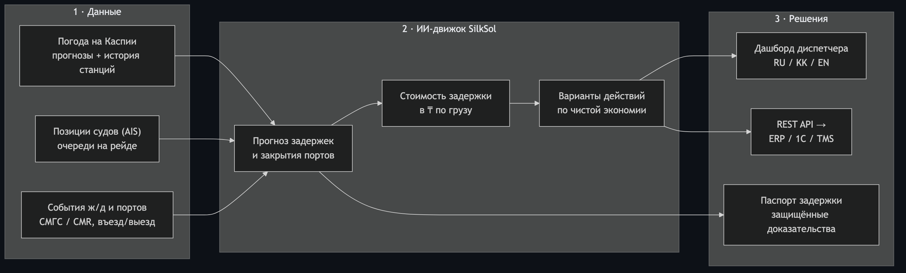
</picture>

🔍 Интерактивная версия (масштаб и перемещение)

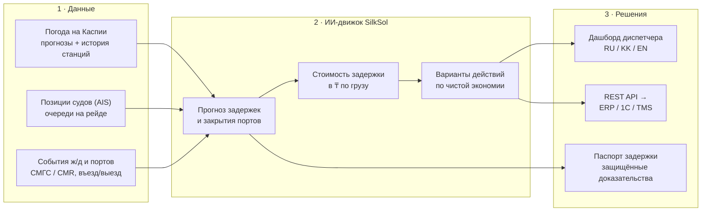

У каждого числа на экране — источник и метка «СИМУЛЯЦИЯ» / «LIVE», у каждой оценки — факторы, которые её определяют, как того требует Закон РК «Об искусственном интеллекте».

### 📈 Проверено на реальных данных

Прогноз закрытия портов обучен на реальных наблюдениях метеостанций Актау и Баку и проверен на отложенном периоде на прогнозах, сделанных за 1–3 дня до события (март 2024 – декабрь 2025: 1 304 порто-дня, 53 дня штормового закрытия).

| Горизонт прогноза | AUC  | Доля штормовых закрытий, предупреждённых заранее | Простое правило «ветер > 15 м/с» |
| ----------------- | ---- | ------------------------------------------------ | -------------------------------- |
| 1 день            | 0,88 | **36 %**                                         | 2 %                              |
| 2 дня             | 0,89 | **32 %**                                         | 2 %                              |
| 3 дня             | 0,89 | **23 %**                                         | 0 %                              |

«Закрытие» определено по устойчивому ветру ≥ 15 м/с — порогу остановки паромов; в пилоте эту погодную метку заменит журнал закрытий капитана порта. Модели простоя и ETA калибруются на данных пилотного партнёра — это и есть цель пилота.

### 🧠 ML и Data Science

| Вопрос, на который отвечает модель                        | Результат                                         | Статус                                     |
| --------------------------------------------------------- | ------------------------------------------------- | ------------------------------------------ |
| Сорвёт ли груз договорный ETA?                            | Вероятность + ETA P10–P90, факторы риска          | Работает; калибруется на данных партнёра   |
| Закроется ли порт из-за шторма в ближайшие 1–3 дня?       | Вероятность закрытия по дням + предупреждение     | **Обучено и проверено на реальных данных** |
| Сколько стоит задержка и какое действие сэкономит больше? | Ожидаемые потери в ₸, варианты по чистой экономии | Работает (демо-тарифы)                     |

- **Данные.** Ежечасные наблюдения метеостанций Актау и Баку (2010–2025), архив численных прогнозов погоды, позиции судов (AIS), события ж/д и портов (СМГС / CMR, въезд / выезд).
- **Проверка без утечки будущего.** Строгое разделение по времени; модель оценивается только на прогнозах, которые реально были доступны за 1, 2 и 3 дня до события; каждый горизонт — отдельно, против простого правила и климатологии (Brier skill).
- **Неопределённость, а не точечные догадки.** Задержка и ETA — распределения (P10–P90) из сценарного моделирования; варианты действий сравниваются на парных сценариях, поэтому разница отражает действие, а не шум.
- **Объяснимость и контроль.** Факторы за каждой оценкой, карточка модели (что откалибровано, а что нет), источник у каждого числа, версионируемые артефакты калибровки и воспроизводимый пайплайн обучения — в духе Закона РК «Об ИИ».
- **MLOps в QazCloud (пилот).** Переобучение на истории партнёра на GPU QazCloud, мониторинг дрейфа и калибровки, выпуск моделей по схеме «чемпион / претендент», локальная LLM для ассистента диспетчера на русском и казахском — данные не покидают Казахстан.

### 🧪 Качество и тестирование

| Уровень                              | Что проверяется                                                                                                                                         | Результат                                                        |
| ------------------------------------ | ------------------------------------------------------------------------------------------------------------------------------------------------------- | ---------------------------------------------------------------- |
| Unit и интеграционные тесты (Vitest) | Движок прогнозов, модель закрытия портов, стоимость задержки и рекомендации, SLA, журнал аудита, отчёты о задержке, REST API, переводы                  | **52 теста**, все проходят                                       |
| Покрытие ядра                        | Ядро расчётов и REST API; экраны сайта проверяются e2e-тестами                                                                                          | **95 % строк** · 93 % инструкций · 94 % функций · 80 % ветвлений |
| E2E (Playwright)                     | Реальный браузер на продакшен-сборке: дашборд, график риска, монитор SLA, выпуск и проверка отчёта о задержке, журнал аудита, переключение EN → RU → KK | **11 сценариев**, все проходят                                   |
| CI (GitHub Actions)                  | Проверка типов, линтер, unit-тесты с покрытием, продакшен-сборка; e2e-набор                                                                             | Воркфлоу в `.github/workflows`, запуск при пуше в `main`         |

### 🗺 Статус и дорожная карта

|     | Возможность                                                                        | Статус                       |
| --- | ---------------------------------------------------------------------------------- | ---------------------------- |
| ✅  | Дашборд (RU / KK / EN), риск задержки, ETA P10–P90, монитор SLA                    | Работающий MVP               |
| ✅  | Прогноз закрытия портов, обученный и проверенный на реальных данных                | Готово                       |
| ✅  | Стоимость задержки в ₸ и рекомендации «что делать»                                 | Работающий MVP (демо-тарифы) |
| ✅  | Паспорт задержки с защищённым журналом аудита                                      | Работающий MVP               |
| ✅  | REST API с ключами доступа и журналом, Docker-образ                                | Готово                       |
| 🔜  | Пилот Актау – Баку: данные о простоях партнёра, договорные тарифы, журнал закрытий | Пилот                        |
| 🔜  | ИИ-ассистент диспетчера на русском и казахском на локальной LLM в QazCloud         | Следующий этап               |
| 🔜  | SSO, PostgreSQL, интеграция с ERP / 1С                                             | Пилот                        |
| 🔭  | Весь ТМТМ: Хоргос, Достык, Поти, Батуми; API скоринга для страховщиков и банков    | Масштабирование              |

Демо работает на симулированном сценарии коридора (с явной пометкой); тарифы в калькуляторе стоимости задержки условные — в пилоте подставляются ставки по договорам партнёра.

### 🚀 План пилота и KPI

Пилот на 3 месяца на маршруте **Актау – Баку** с оператором ж/д или порта, в инфраструктуре QazCloud.

<picture>
  <source media="(prefers-color-scheme: light)" srcset="docs/diagrams/pilot-plan.ru.light.png">
  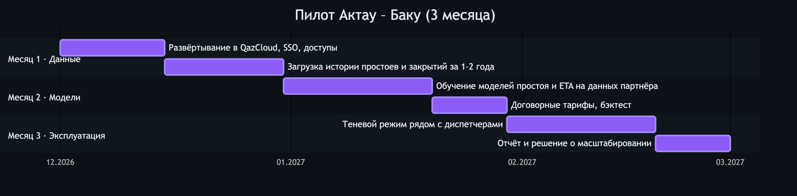
</picture>

🔍 Интерактивная версия (масштаб и перемещение)

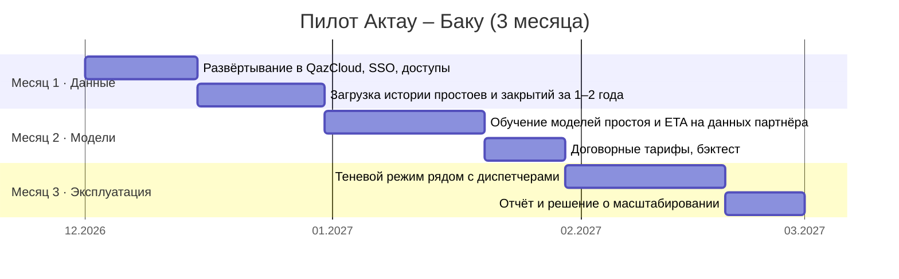

| KPI                                         | Как измеряется                                                                                 | Цель                                              |
| ------------------------------------------- | ---------------------------------------------------------------------------------------------- | ------------------------------------------------- |
| Точность ETA                                | Ошибка прогноза прибытия против факта, в сравнении с текущим планированием партнёра            | Лучше текущего плана; конкретная цель — на старте |
| Штормовые закрытия, предупреждённые заранее | Доля дней закрытия, отмеченных за ≥ 24 ч, по журналу капитана порта                            | ≥ 30 % (на погодной метке уже 36 %)               |
| Сэкономленные деньги                        | ₸ демереджа, простоя вагонов и штрафов SLA, которых удалось избежать по принятым рекомендациям | По каждому грузу и в сумме                        |
| Споры                                       | Споры о задержках, закрытые паспортом задержки, по сравнению с периодом до пилота              | Меньше споров, быстрее урегулирование             |
| Использование                               | Диспетчеры, работающие с дашбордом еженедельно; принятые рекомендации                          | Согласуется на старте                             |

**Что нужно от партнёра:** ВМ или namespace в QazCloud с SSO; 1–2 года событий простоя (прибытие / убытие по узлам, СМГС / CMR) и журнал закрытий капитана порта; договорные тарифы; одна команда диспетчеров для теневого режима и обратной связи.

### ☁️ Развёртывание в QazCloud

<picture>
  <source media="(prefers-color-scheme: light)" srcset="docs/diagrams/deployment.ru.light.png">
  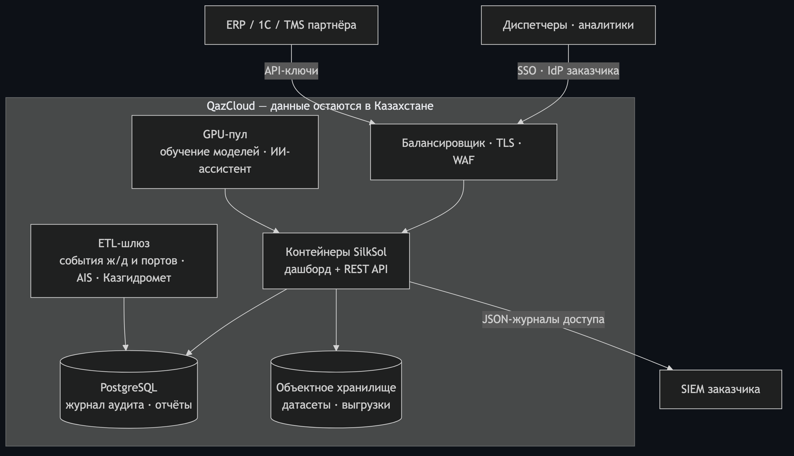
</picture>

🔍 Интерактивная версия (масштаб и перемещение)

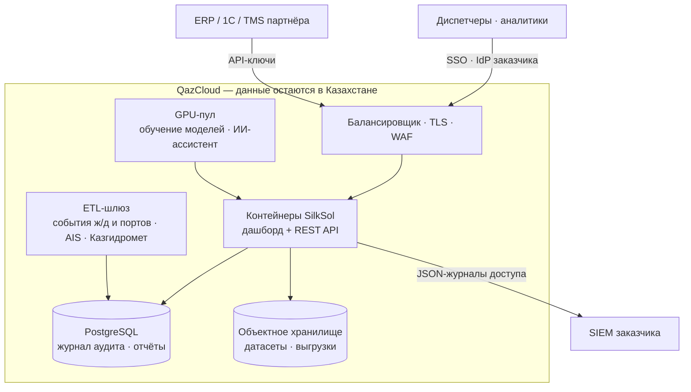

- Один контейнер (дашборд + API), без прав root, файловая система только для чтения, health check.
- Все данные, бэкапы и персональные данные остаются в Казахстане; развёртывание в контуре заказчика.
- Соответствие Закону РК «Об ИИ», локализация персональных данных и требования корпоративной ИБ: [docs/COMPLIANCE.md](./docs/COMPLIANCE.md). Развёртывание: [docs/DEPLOYMENT.md](./docs/DEPLOYMENT.md). API: [docs/API.md](./docs/API.md).

### ⚡ Зачем нам QazCloud

| Ресурс QazCloud                    | Для чего он SilkSol                                                                                                                                                                                                                             |
| ---------------------------------- | ----------------------------------------------------------------------------------------------------------------------------------------------------------------------------------------------------------------------------------------------- |
| **GPU**                            | Локальная LLM для ассистента диспетчера на русском и казахском (инференс и дообучение на языке логистики) — данные не уходят в зарубежные ИИ-сервисы; большие сценарные симуляции и подбор гиперпараметров при переобучении на истории партнёра |
| **CPU / Kubernetes**               | Дашборд и REST API, движок прогнозов и сценариев «что если», плановое переобучение моделей простоя и ETA                                                                                                                                        |
| **Хранилище в Казахстане**         | История простоев партнёра, журнал аудита, отчёты о задержках, датасеты для обучения — персональные данные остаются в стране                                                                                                                     |
| **Экспертиза в AI и Data Science** | Ревью протокола проверки, мониторинг моделей, практики MLOps                                                                                                                                                                                    |
| **Пилот в портфельной компании**   | Реальные данные о простоях и журналы капитана порта — то, что превращает экспертную модель простоя в обученную                                                                                                                                  |

### 🛡 Безопасность

| Мера                 | Как                                                                                                                                     | Статус |
| -------------------- | --------------------------------------------------------------------------------------------------------------------------------------- | ------ |
| Доступ к API         | Ключи по клиентам, хранятся как SHA-256, сравнение за постоянное время; публичны только health и спецификация                           | ✅     |
| Аудит                | JSON-журнал каждого вызова API (имя клиента, никогда не ключ) → SIEM заказчика; защищённая от подделки цепочка SHA-256 по каждому грузу | ✅     |
| Контейнер            | Без root, файловая система только для чтения, no-new-privileges, health check                                                           | ✅     |
| Секреты              | Только в окружении / хранилище секретов — никогда в образе и в репозитории                                                              | ✅     |
| Резидентность данных | Все данные, бэкапы и персональные данные — в ЦОД QazCloud в Казахстане                                                                  | Пилот  |
| Идентификация        | SSO через IdP заказчика (OIDC) или Keycloak; ролевой доступ                                                                             | Пилот  |
| Сеть                 | TLS, WAF и ограничение частоты запросов на балансировщике QazCloud                                                                      | Пилот  |
| Цепочка поставок     | Зафиксированные зависимости; сканирование образа на уязвимости в CI пилота                                                              | Пилот  |

### 💼 Бизнес-модель

<picture>
  <source media="(prefers-color-scheme: light)" srcset="docs/diagrams/business-model.ru.light.png">
  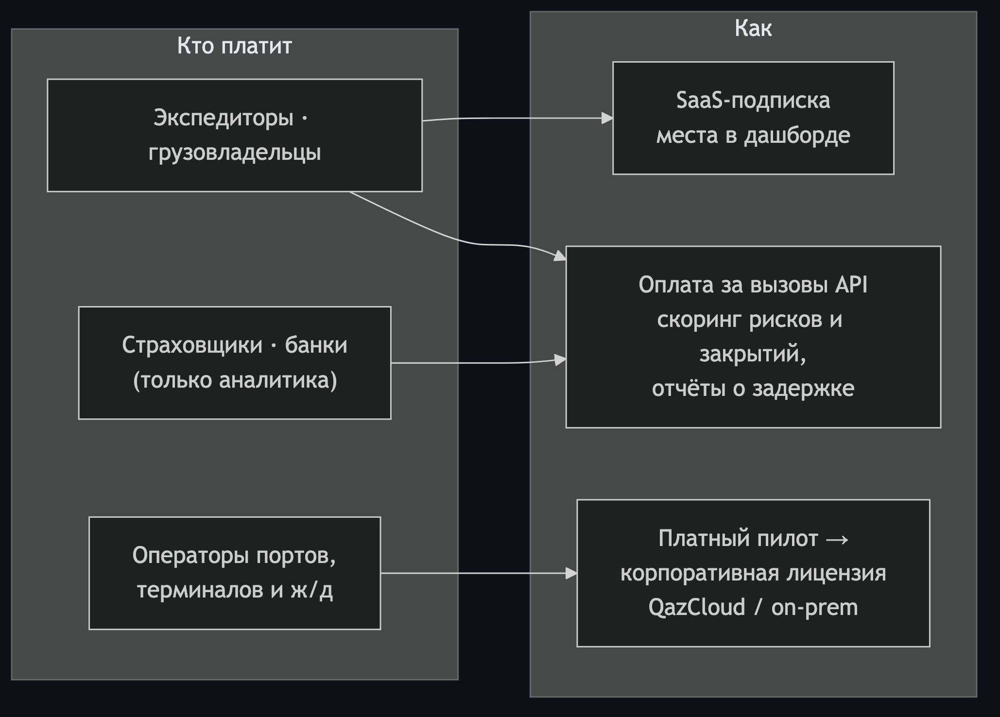
</picture>

🔍 Интерактивная версия (масштаб и перемещение)

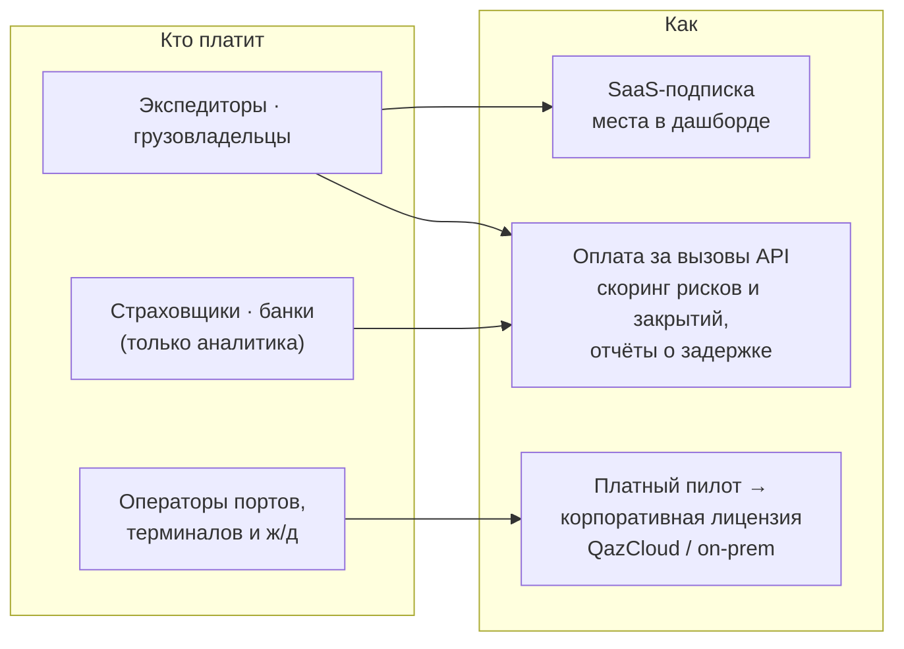

Цена оправдана деньгами, которые экономит платформа: предотвращённые демередж, простой вагонов и штрафы по SLA — видны по каждому грузу в тенге.

### 🛠 Технологии

React 19 · TypeScript · TanStack Start · Tailwind CSS · Recharts · Node.js 22 · Docker · Vitest · Playwright. Интерфейс на русском, казахском и английском.

### 🔒 Интеллектуальная собственность и лицензия

**SilkSol Intelligence — проприетарное программное обеспечение. Репозиторий опубликован только для ознакомления и не является open source.**

- © 2026 **SilkSol / s0nakh**. Все права защищены. Исходный код, модели и их параметры, методы калибровки и оценки, пайплайны обработки данных, логика тарифов и рекомендаций, интерфейс, тексты, название «SilkSol» и логотип охраняются Законом РК «Об авторском праве и смежных правах», Гражданским кодексом РК и международными договорами об авторском праве.
- **Лицензия не предоставляется.** Запрещено без предварительного письменного разрешения копировать, изменять, развёртывать, размещать, продавать, сублицензировать, создавать производные продукты, а также использовать этот код, модели или документацию для обучения или сравнения других систем — в коммерческих и любых иных целях.
- Просмотр репозитория на GitHub (в пределах, которые допускают Условия использования GitHub) не даёт права на использование.
- Авторство и дата создания подтверждаются историей коммитов. Нарушения преследуются по законодательству Республики Казахстан.
- Сотрудничество, пилоты и лицензирование: **sophia.akhmetova@datariglab.kz**.

Полный текст: [LICENSE](./LICENSE).

---

## 🇰🇿 Қазақша

<b>Қазақша нұсқасын ашу</b>

 

▶ [Демо 90 секундта](https://www.loom.com/share/b71579e4a4ca41319a6399515338aac8) · ▶ [Толық шолу, 8 минут](https://www.loom.com/share/a0cfb3ba7f3948a194fdc93fd32de418) (бейнелер орыс тілінде)

**SilkSol Intelligence** — Орта дәліз (ТХКБ) логистикасына арналған шешім қабылдауды қолдайтын ЖИ жүйесі: қай жүктің кешігетінін, оның теңгемен қанша тұратынын және не істеу керектігін алдын ала көрсетеді. [Демо](https://silksol-intelligence.datariglab.kz).

### Негізгі мүмкіндіктер

|     | Мүмкіндік                                             | Пайдаланушы не алады                                                                                |
| --- | ----------------------------------------------------- | --------------------------------------------------------------------------------------------------- |
| 🔮  | **Кешігу тәуекелінің болжамы**                        | Әр жүктің шарттық ETA-ны бұзу ықтималдығы, ETA P10–P90 және тәуекел факторлары                      |
| 🌊  | **Нақты деректерде оқытылған порттың жабылу болжамы** | Ақтау, Құрық және Баку порттарының дауылмен жабылу ықтималдығы 1–3 күн бұрын                        |
| ₸   | **Кідірістің теңгемен құны**                          | Жүк бойынша күтілетін шығын: сақтау және демередж, вагондардың тұрып қалуы, SLA айыппұлдары, кешігу |
| 🧭  | **Не істеу керек — үнеммен**                          | Нұсқалар (Ақтау ↔ Құрық, басым паром, дауыл кезінде вагондарды ұстау) теңгедегі таза үнеммен        |
| 🧾  | **Кідіріс паспорты**                                  | Дауларды шешуге, сақтандырушылар мен банктерге арналған қолдан жасаудан қорғалған есеп              |

### Нақты деректермен тексеру

Порттың жабылу болжамы Ақтау мен Баку метеостанцияларының бақылауларында оқытылып, 1–3 күн бұрынғы болжамдарда тексерілді (2024 ж. наурыз – 2025 ж. желтоқсан): **AUC 0,88–0,89**. Тұрып қалу және ETA модельдері пилоттық серіктестің деректерінде калибрленеді.

### ML және сапа

Модель тек оқиғадан 1, 2 және 3 күн бұрын шын мәнінде қолжетімді болған болжамдарда бағаланады. Нәтижелер — үлестірімдер (P10–P90), әр бағаның факторлары көрсетіледі. 52 unit-тест, ядроның 95% жолдары тестпен қамтылған, 11 e2e-сценарий, GitHub Actions CI-воркфлоулары.

### Пилот, QazCloud және қауіпсіздік

3 айлық пилот Ақтау – Баку бағытында: QazCloud-та орналастыру, серіктестің тұрып қалу тарихында модельдерді оқыту, диспетчерлермен «көлеңкелі режим». KPI: ETA дәлдігі, дауылдық жабылуларды ≥ 24 сағат бұрын ескерту үлесі, ұсыныстар бойынша үнемделген теңге. GPU — орыс және қазақ тілдеріндегі диспетчер ассистентінің жергілікті LLM-і үшін. API кілттері, SIEM-ге арналған журнал, root-сыз контейнер — дайын; деректерді ҚР-да сақтау, SSO, TLS/WAF — пилотта.

### Зияткерлік меншік

**SilkSol Intelligence — меншікті бағдарламалық қамтамасыз ету. Репозиторий тек танысу үшін жарияланған, open source емес.** © 2026 SilkSol / s0nakh. Барлық құқықтар қорғалған. Жазбаша рұқсатсыз көшіруге, өзгертуге, орналастыруға, сатуға, туынды өнімдер жасауға және басқа жүйелерді оқытуға пайдалануға тыйым салынады. Бұзушылықтар Қазақстан Республикасының заңнамасы бойынша қудаланады. Толық мәтін: [LICENSE](./LICENSE).

